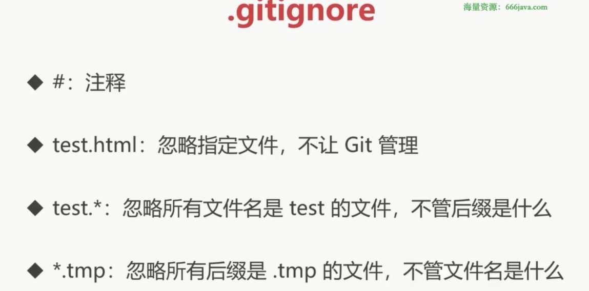
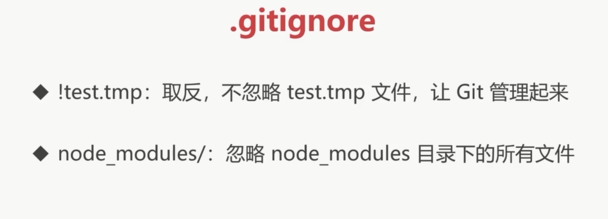

# 版本控制

- 记录文件变化,生成版本
  - 查看历史版本
  - 恢复指定版本
  - ....

# 版本控制的发展

- 集中式版本控制
  - SVN(需要联网)
- 分布是版本控制
  - git(不需要联网 本地和远程都有一份)

# Git 三大区域


# 生成版本


- git 全局配置用户信息
  - `git config --global user.name 'xxxx'`
  - `git config --global user.email 'yyyy'`
- git init
- git status
- git add xx
- git commit -m 'xxx'
- git log(commit 的提交版本)

# 版本重置


# Git 忽略文件

- .gitignore
- 指定哪些文件不需要 Git 管理

```
# 注释

# 要忽略的文件

# 忽略指定文件，不让 Git 管理
# test.html

# 忽略所有文件名是 test 的文件，不管后缀是什么
test.*

# 忽略所有后缀是 .tmp 的文件，不管文件名是什么
# *.tmp

# 取反，不忽略 test.tmp 文件，让 Git 管理起来
# !test.tmp

# 要忽略的目录（中的文件）
# 空目录会自动被 Git 忽略掉 .gitkeep 占位

# 忽略 node_modules 目录下的所有文件
node_modules/

```




# 分支


# 远程仓库


